<div align="center">

# eagle 鹰眼 · AI 咨询管理系统

**个体管理咨询师的 AI 全能工作系统**
**一个咨询师 + 22 个数字员工 + 199 个专业技能，24 小时不停歇**
**一个企业一个档案 · 信任 = 判断力 × 上下文深度 × 可归因性**

[](LICENSE)
[](https://www.npmjs.com/package/@deepseek-ai/dsh)
[](https://github.com/geniusdapeng-collab/workloom-im)
[]()
[]()
[]()

**[English](README_EN.md)** · 简体中文

</div>


<!-- CAPABILITIES:BEGIN -->
<!-- 本区块由 scripts/generate-capabilities.mjs 自动生成（2026-09-02），请勿手改；重跑 pnpm capabilities 更新 -->

## 🧩 系统能力速览（自动生成 · 与代码同步）

- 🖥 **三端应用（开箱即看）**：PC 端 · B 端工作台 · 移动端 · B 端高保真 · 移动端 · C 端 AI 服务前台
- 🏨 **行业 Bundle（垂直能力包）**：bundles/consulting/ · bundles/hotel/
- 🖐 **操作电脑能力（本仓自带 · 可装生产工作站）**：computer-use 三层感知（65 动作） · HTTP 远程驱动 + MCP server
- 🤖 **AI 自动化引擎（系统内置能力）**：围栏 DSL 引擎 · L2 编排（ASK/QUEST） · 夜班自动运行 · 模型路由 · 五元事件 + RLS 隔离 · IM 渠道 等 9 项
- ✅ **验证与质量（工程纪律）**：一键安装（bootstrap） · 主测试套件 · 发布门禁 · 五元事件验链 · Agent 能力巡游 · 环境自检
- 🎁 **演示与交付资产**：高保真演示页 ×6 · 官网静态站 · 自带技能 ×3 · 能力导览 PPT · Mock 数据体系

> 📖 完整能力导览（含截图与体验路径）：[docs/capabilities.auto.md](docs/capabilities.auto.md) ｜ 🤖 AI Agent 入口：[AGENTS.md](AGENTS.md) ｜ 🎯 首启必跑：`pnpm preview:all`
<!-- CAPABILITIES:END -->

---

## 写给谁

写给**专业的企业咨询师、个体管理咨询师与精品咨询工作室**——那些一个人就是一支队伍的人：

> 你一个人扛获客、诊断、方案、交付、维系、收款；你的纯判断时间每周不足 15 小时，其余都耗在纪要、排版、找素材、催资料上；你明明服务得很好，续约时客户却说"没看到价值"；你想多接几家客户，但你的时间已经卖完了。

eagle 就是为你造的：**你继续做只有你能做的事——见客户、下诊断、做判断、谈续约；其余的一切，交给一支 24 小时不下班、比专业人类团队更守规矩的数码咨询班组。**

---

## 先回答一个问题：AI 时代的企业咨询，最大的改变是什么？最核心的点是什么？

> **最大的改变：咨询的价值重心，从「一次性交付判断」迁移到「持续性积累认知」。**

传统咨询是脉冲式的：项目启动（认知快速建立）→ 交付（认知打包成 PPT）→ 撤离（认知随团队离开而蒸发）。客户每开一个新项目，都要重新付费购买一次"认知爬坡"。AI 击穿了研究、分析、起草环节的成本结构，也击穿了按人天计费的定价借口——服务形态从"项目脉冲"切换为"认知常流"：Agent 7×24 在场，企业每天的经营事件持续流入档案，**认知不再蒸发，而是复利**。

> **最核心的点：竞争壁垒从「顾问的头脑」迁移到「客户侧不断加厚的、可归因、可审计的机器可读认知资产」——也就是企业档案。**

通用大模型已经能给任何企业生成一份"像模像样"的战略建议，但它不知道这家企业三年前砍掉的产品线为什么失败、不知道老板的决策偏好、不知道上次变革卡在哪个人身上。咨询的真正壁垒从来不是分析框架（框架全网公开），而是**对客户企业的深度上下文**。AI 时代的分水岭在于：这份上下文能否被机器可读化、持续累积化、可归因化。

由此导出 AI 时代的咨询信任公式，也是 eagle 全部设计的总纲：

**信任 = 判断力 × 上下文深度 × 可归因性** ——三者缺一，建议就退化为"高级废话"。

---

## eagle 是什么

**eagle 鹰眼咨询管理系统** = 一个咨询师 + 一支 24 小时不停歇的专业数码咨询班组（22 个数字员工）+ 一个 199 项技能的专业技能库 + 每家企业客户一份持续加厚的认知资产档案。

它基于 [WorkLoom 企业级 Agent IM 基座](https://github.com/geniusdapeng-collab/workloom-im) 深度定制：底座九域能力（五元事件库 / 围栏引擎 / 审批触达 / IM 通道 / 夜班班组 / 巡检中心 / 技能市场 / 多租户 / 模型路由 + 自我进化飞轮 + 数字CEO）**原样继承、零改动**；咨询行业差异 100% 经行业 Bundle（`bundles/consulting/` v2.0.0）装配注入。

**人机分工铁律——高光时刻留给人**：澄清会、访谈执行、诊断定调、汇报会、续约谈判这 5 类高信任场景，系统**硬性禁止 AI 替身**（围栏 C-R4，block 级）；AI 把高光之外的一切碾平。对咨询全流程 30 个环节的拆解结论：11 个环节完全自动化、13 个人机协作、只有 6 个必须人来——而那 6 个，恰是客户付费感知的全部高光。

---

## 系统架构图

<p align="center"></p>

五层结构自上而下：**体验层**（PC 工作台 / 移动 B 端 / C 端咨询服务前台 / IM 通道）→ **服务层**（Hono + tRPC，PG 行级安全）→ **咨询行业 Bundle**（22 数字员工 / 199 技能 / 围栏 C-R1~C-R9 / 一企一档 / 服务前台资产）→ **底座九域**（WorkData 数据大脑为核心）→ **运行时与数据层**（DeepSeek Harness + PostgreSQL 17 + pgvector，本地优先、数据主权）。

---

## 一企一档：产品宪法

**一个企业一个档案。** 每家企业客户拥有一份七大分区的认知资产档案，随服务持续加厚：

| 分区 | 内容 | 喂养方式 |
|---|---|---|
| ① 基本面 | 工商信息、股权结构、组织图谱、发展阶段 | 体检期快照快扫 + 客户提交 |
| ② 经营仪表盘 | 核心指标月度序列（营收/毛利/人效/现金流） | 数据接入 + 夜班监测自动更新 |
| ③ 认知沉积 | 历次诊断结论、方案要点、决策与取舍记录 | 每次交付自动归档 |
| ④ 人物志 | 关键人画像：决策偏好、沟通风格、关系温度 | 访谈/会议纪要素描，人审入库 |
| ⑤ 行动账本 | 行动项、负责人、期限、逾期升级 | 陪跑期自动跟踪催办 |
| ⑥ 文件库 | 合同、财报、纪要、报表截图（多模态原件） | 服务前台上传，脱敏后入库 |
| ⑦ 价值台账 | 每次服务动作与挽回/创造价值的量化留痕 | 逐事件计量自动投影 |

三条宪法：**认知资产归客户所有**（可导出，local-first 数据主权）；**每条建议挂依据链**（五元事件 + SHA-256 哈希链，可归因可审计）；**客户数据不外发**（围栏 C-R9 物理拦截，不是口头承诺）。

---

## 22 个数字员工：一支比人类团队更专业的咨询班组

### 核心管线班组（获客→诊断→交付→陪伴→经营）

| 数字员工 | 职责 | 夜班 |
|---|---|---|
| 总参谋长 | 班组调度、议题分诊、向主理人请示（对接数字CEO六步深度管线：情报→案例回忆→多方案→红队对抗→影响预估→Memo Pro） | ✅ |
| 线索管家 | 线索登记/资格初筛/跟进提醒/冷线索池防误判 | ✅ |
| 情报研究员 | 会前情报简报、行业研究、竞对情报（网络情报 7×24 研判挖掘） | ✅ |
| 访谈秘书 | 提纲生成、转写、纪要初稿、矛盾点标注（PII 脱敏前置） | ✅ |
| 诊断分析师 | 数据清洗、勾稽校验、诊断框架素材、红队反证（AI 是检察官不是法官） | ✅ |
| 方案架构师 | 提案初稿（模板+档案生成约 70%）、报价测算建议（外发前必审） | — |
| 报告排版师 | 报告初稿、PPT 排版、对外版脱敏改写 | ✅ |
| 质检官 | 交付物出厂质检、敏感类目必审路由、合规提示校验 | ✅ |
| 陪伴管家 | 常年顾问核心：月度监测、月报初稿、分级应答、流失信号 | ✅ |
| 资源对接经纪人 | 专家匹配、合规预检、纪要入库（涉密红线零妥协） | — |
| 守夜巡检 | 客户经营异动夜间监测、深夜消息第一响应（接住但不替人做主） | ✅ |
| 经营账房 | 开票记账、催收分级、盈亏台账、续约季价值报告弹药 | ✅ |

### 垂直专家班组（按咨询专业分工）

| 数字员工 | 职责 | 夜班 |
|---|---|---|
| 战略顾问 | 战略澄清、三年规划、第二曲线设计（7S/五力/BLM/竞争战略） | ✅ |
| 组织人力顾问 | 组织效能、绩效薪酬、人才梯队、变革管理（敏感内容必审+合规提示） | ✅ |
| 运营精益顾问 | 流程再造、精益生产、供应链、交付周期压缩、成本削减 | ✅ |
| 营销增长顾问 | 品牌定位、增长黑客、内容营销、销售漏斗、客户分层 | ✅ |
| 财务资本顾问 | 财报分析、全面预算、现金流、估值模型、融资准备 | ✅ |
| 数字化与AI转型顾问 | AI 战略、AI 场景识别、数字员工部署、AI 治理（AI native 变革操盘手） | ✅ |
| 风控合规官 | 合规扫描、合同风控、危机预案（法律意见强制持牌复核） | — |
| 行业专家 | 制造业/餐饮零售/SaaS/消费品牌/医疗/教培的行业 know-how 库 | ✅ |
| 交付总监 | 报告故事线、PPT 叙事、工作坊引导、项目复盘、文档自动化 | — |
| 增值服务设计师 | 基于客户档案的增值服务机会识别与产品化（情报订阅/预警值守/系统托管） | ✅ |

**24 小时不停歇**：19 个夜班员工在 22:00–08:00 谷时算力窗口（费率 ×0.2）执行批量研究/转写/监测，**08:30 清晨决策包**（已完成/待审批/需介入三栏）准时送达主理人手机——你醒来时，昨夜的工作已经躺好等你拍板。

---

## 199 个专业技能库：15 大类，下探到毛细血管

> 199 项技能 = **189 个细分专业技能（15 大类）** + 10 个核心管线技能。每项技能都是一份可执行的方法论文档（适用场景/方法步骤/输出契约），安装即绑定围栏，卸载即收缩。

| 大类 | 数量 | 代表技能 |
|---|---|---|
| A · 情报与洞察 | 16 | 政策雷达、竞对动态追踪、舆情预警、招聘情报解码、市场规模测算、趋势研判 |
| B · 企业诊断 | 18 | 7S/BLM/SWOT深析/五力/价值链、战略/组织/运营/财务/营销/供应链六维体检、AI就绪度、现金流风险 |
| C · 战略与规划 | 12 | 战略澄清工作坊、三年规划、第二曲线、出海战略、竞争战略、蓝海战略 |
| D · 组织与人力 | 13 | 组织架构、薪酬绩效、股权激励、人才梯队、变革管理、用工合规 |
| E · 运营与流程 | 12 | 流程再造、精益生产、六西格玛、库存优化、交付周期压缩、成本削减 |
| F · 营销与增长 | 14 | 品牌定位、增长黑客、私域运营、定价策略、大客户经营、续约增购 |
| G · 财务与资本 | 12 | 财报分析、全面预算、税务筹划、估值模型、尽职调查、商业计划书 |
| H · 数字化与AI转型 | 16 | 数字化路线图、AI 战略、AI 场景识别、AI 原生组织设计、数字员工部署、AI 治理 |
| I · 行业专精 | 16 | 制造业精益/智能工厂、餐饮单店模型/连锁扩张、SaaS 指标体检、品类创新、诊所运营、教培续费率 |
| J · 交付与知识管理 | 13 | 访谈技术、报告撰写、PPT 故事线、工作坊引导、方法论提炼、文档自动化 |
| K · 客户经营与持续服务 | 12 | 年度价值报告、月度观察报告、续约风险管理、情报订阅、预警值守、董事会支持 |
| L · 风险与合规 | 10 | 合规体检、劳动法风险、数据合规、合同风控、危机公关、ESG |
| M · 创业与中小企业专项 | 9 | 创业体检、商业模式验证、融资路演、股权架构、家族传承、专精特新申报 |
| N · 新技术前沿 | 8 | AI Agent 落地、大模型选型、具身智能、数字孪生、低空经济、新能源转型 |
| O · 国际化与资源对接 | 8 | 出海合规、跨境财税、海外市场进入、专家/产业/融资资源对接 |

**AI 优势的充分放大**：情报类技能把"一个分析师每周翻几千条信息"变成"7×24 多源交叉验证的雷达网"；竞对分析把"同类产品拆解"做成持续追踪+异动告警；AI 转型类技能则直接回答"AI native 时代企业怎么转"——这是头部咨询机构卖几十万的方法论，现在是你的数字员工的标准装备。

---

## Agent 协作数据管道图

<p align="center"></p>

客户消息（文字/截图/语音/文件）→ 入站五元化 → 安全网关三段瀑布（PII 脱敏→围栏预检→幂等）→ 意图路由（Ask/Agent/Quest 三态）→ 班组协作管道（研究→诊断→方案→质检）→ 围栏判定（auto 自动 / review 人审 / block 熔断）→ 执行留痕 → 一企一档归档 → 组织记忆夜班提炼 → 偏好注入回流（越用越懂你）→ 月报/价值报告/清晨决策包输出。**每一次驳回都回流为校准样本——系统进化的飞轮在管道里，不在 PPT 里。**

---

## 围栏与信任工程：比人类团队更守规矩

咨询的危险动作是"内容型"的，eagle 的围栏遵循三原则：**数值围栏先行、语义围栏保守路由（分类器命中即必审，宁多审勿漏放）、信任型行业默认偏紧**。

基线围栏 `consulting-baseline/v1`（default_level=review，客户 patch 只可收紧）：

| 规则 | 内容 | 级别 |
|---|---|---|
| C-R1 | 单笔报价 ≤2 万元且使用标准价目表 | auto |
| C-R2 | 含诊断结论/组织建议/人员评价的内容外发 | review（必审） |
| C-R3 | 合同金额 >10 万或非标条款 | review |
| C-R4 | AI 不得以咨询师身份首次会面/访谈/谈判 | **block** |
| C-R5 | 客户 PII 未脱敏处理 | **block** |
| C-R6 | 退款、折扣 >20%、免费增项 | review |
| C-R7 | 劳动法/税务等合规边界建议（强制附合规提示） | review |
| C-R8 | 涉密领域专家对接、跨境敏感信息 | **block** |
| C-R9 | 客户敏感数据外发第三方 | **block** |

审批一次通过率、修改率、8 周趋势全部进**进化积分卡**——信任不是说的，是积分卡证明的。

---

## 持续服务（常年顾问）：刚需必选

咨询行业续约流失的第一原因不是服务不好，而是**"好得没有证据"**。eagle 把常年顾问做成五节拍的认知常流：

- **日**：客户经营指标监测、行业情报扫描（夜班）
- **周**：行动项逾期催办、冷线索/风险 5 分钟速览、情报周报
- **月**：月度观察报告（数据异动+建议，人审后外发，5 日前送达）
- **季**：深度复盘包、续约风险评估
- **年**：**年度价值报告**——价值台账自动汇总（挽回多少流失、避免多少风险、创造多少增量），每行可下钻到五元事件证据链

## 多模态 AI 服务前台：超越预期的服务

企业客户侧的服务前台（`apps/webc`，H5/小程序入口）7×24 在线：

- **多模态入站**：客户随手发**报表截图、语音留言、合同文件** → 自动解析 → PII 脱敏 → 与历史口径比对标注异常 → 归档入一企一档。客户早上还没开口，咨询师已经知道了。
- **分级应答**：常规问题基于企业档案与方案知识库即时应答；敏感问题自动升级。
- **紧急通道**：深夜焦虑留言，AI 先行安抚与信息收集，同步升级叫醒主理人——"接住，但不替人做主"。
- **服务目录**：快速问答/预约深谈/资料提交/报告与档案/紧急呼叫，SLA 透明。

---

## 业务流程图：不同端上的用户旅程

<p align="center"></p>

**咨询师（PC）**：08:30 收清晨决策包 → 审批卡片三手势 → 一句话派遣 Quest → 高光时刻亲自上场；**咨询师（移动端）**：随时审批改派、客户现场调档案、一键塔台制动；**企业客户（C 端）**：问月报、发截图、收报告、紧急呼叫；**系统（夜班）**：监测/研究/批量作业，P0 才叫人，其余进决策包。

---

## 服务类型产品矩阵：从一次项目到认知常流

<p align="center"></p>

| 层 | 服务类型 | 定价形态 | AI 自动化程度 |
|---|---|---|---|
| 引流层 | 免费快速体检（15-30 分钟快照快扫报告） | 免费钩子 | ~95% |
| 转化层 | 深度诊断、方案设计 | 项目制 | ~70% |
| 常流层 | 落地陪跑、常年顾问（日监测/月月报/季复盘） | 月费订阅 | ~85% |
| 增值层 | 情报订阅、预警值守、系统托管、资源对接 | 订阅+托管费 | ~95% |

**增值服务是毛利最高的第二层曲线**：完整方案见 [《eagle 增值服务与自动化服务化方案》](docs/eagle-增值服务与自动化服务化方案.md)——6 个可交付产品（情报订阅/预警值守/月报增强/年度价值报告/知识订阅/系统托管），含定价建议、成本测算（算力成本仅占收入 0.1%，毛利约 91%）与 90 天落地路径。其中最旗舰的是**为客户企业部署 WorkLoom 系统**：装机费（项目制）+ 托管费（常流），每服务一个新行业客户就沉淀一个可复用行业 Bundle——咨询经验第一次变成可反复销售的资产。

---

## 数字班组的一天（运行态剧本）

> 22:00 夜班班组上线：守夜巡检扫恒昌机械 8 月指标（营收环比 -6%，触发 P1）；访谈秘书转写川渝味道 2 场店长访谈（脱敏后入库，标注 2 处矛盾点）；情报研究员生成装备制造原材料周报（冷轧板卷 +3.2%，与恒昌毛利异动自动关联）。
>
> 23:40 恒昌王总发来语音留言（情绪低落）。守夜巡检先安抚+整理要点，同步升级——但不替主理人做主。
>
> 00:30 陪伴管家生成恒昌 8 月月报初稿；质检官发现其中一段含人员评价，自动挂起必审（C-R2）。
>
> 01:15 访谈秘书试图把一份未脱敏纪要入库，被 C-R5 物理熔断并告警。
>
> 08:30 主理人陈鹰打开手机：清晨决策包——已完成 9 项、待审批 4 件（月报外发/年度合同报价/专家对接/诊断段落措辞）、需介入 1 件（王总语音留言实录+要点）。地铁上点完 3 个采纳、1 个编辑后采纳，驳回原因选「语气不符」——系统记住了他的口味。
>
> 这就是 eagle 的日常：**咨询师睡觉，班组上班；咨询师醒来，只做裁决。**

---

## 五分钟跑起来（全模拟运行态）

> **⚠️ 强制约定：首次启动必须执行 `pnpm preview:all`。**
> 一键拉起**三端全貌**并自动固化演示种子数据（无需任何真实后端/密钥）：

```bash
pnpm setup && pnpm preview:all
```

| 端 | 地址 | 你将看到 |
|---|---|---|
| 🖥 PC 端 · B 端工作台 | http://localhost:3000 | **鹰眼咨询所经营剧场**：总参谋长晨报、数字员工卫星群、待决策请示、作战室数字职场 |
| 📱 移动端 · B 端 | http://localhost:3001 | 高保真演示页 + 手机壳容器 |
| 📱 移动端 · C 端 | http://localhost:3002 | **咨询服务前台**（企业客户视角：月报问答、截图解析、紧急呼叫） |

演示种子是"忠实主理人高频重度使用"的咨询所全运行态：**3 家企业客户档案**（恒昌机械·常年顾问期 / 川渝味道·诊断期 / 星澜科技·体检期）、100 条五元事件剧本（C-R 全命中样本：报价自动、月报必审、AI 代见客户被熔断、未脱敏入库被拦截）、夜班决策包、审批卡片、多模态会话实录。页面顶部琥珀色横幅为刻意的运行态标识；接入真实数据走落地向导（`/onboarding`）。

日常开发 `pnpm dev` 只起 PC 端（server:8787 + web:5173）。真实大模型接入：`.env` 配置 `LLM_PROVIDER/LLM_BASE_URL/LLM_API_KEY/LLM_MODEL`（任意 OpenAI 兼容端点），真实试调通过才落盘。

---

## 仓库地图（相对基座的增量）

| 路径 | 内容 |
|---|---|
| `bundles/consulting/` | **咨询行业 Bundle v2.0.0（本仓核心增量）**：22 preset / 围栏 C-R1~C-R9 / 199 技能（189 细分 15 大类 + 10 核心管线）/ 一企一档 Schema / 对象 12 类 × 阶段 6 个 / 模型路由策略 / 反馈枚举词表 / 数字职场场景包 / 服务前台资产 |
| `scripts/seed-consulting.ts` | 鹰眼咨询所演示种子（与酒店演示集并存，`pnpm db:seed` 一键双种子，事件命名空间硬隔离） |
| `apps/webc/` | C 端服务前台咨询化（配置驱动：品牌/服务目录/演示剧本/降级应答） |
| `apps/server/src/service/gateway.ts` | 工单类型枚举扩展（meeting/material/urgent/report） |
| `docs/eagle-增值服务与自动化服务化方案.md` | 增值服务课题完整方案（6 产品/成本账/90 天路径） |
| `docs/images/eagle/` | 系统架构/数据管道/业务流程/服务矩阵四张架构图 |
| `packages/base/*` | **底座零改动**（WorkLoom 九域能力原样继承） |

质量门禁与基座同口径：`pnpm typecheck` · `pnpm test`（vitest）· `pnpm db:verify-chain`（哈希链）· `pnpm suite`（全场景用例）· `pnpm release:gate`。

## 血缘与致谢

eagle 鹰眼基于 **[WorkLoom 织元 · DeepSeek Harness 企业级 Agent IM](https://github.com/geniusdapeng-collab/workloom-im)** 深度定制——以消息（五元事件）为唯一事实源、以规则围栏为行动权限边界、以三态会话为人机分工范式的人机协作网络。酒店行业演示 Bundle（`bundles/hotel/`）作为基座参考实现一并保留。运行时地基 [DeepSeek Harness](https://www.npmjs.com/package/@deepseek-ai/dsh)（MIT）；[pgvector](https://github.com/pgvector/pgvector) 组织记忆语义检索；Hono / tRPC / React / Vite 工程基座。

## License

[Apache-2.0](LICENSE) © eagle 鹰眼咨询管理系统。vendor/dsh 与 vendor/dsh-im 遵循其各自 MIT 许可。
